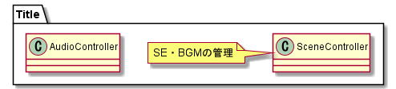
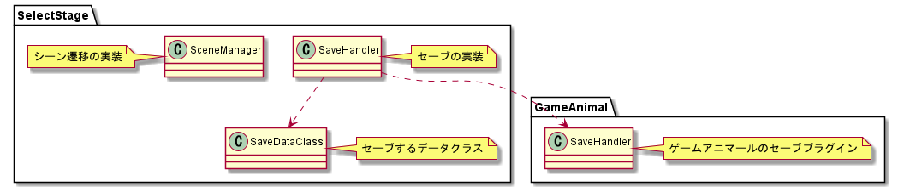
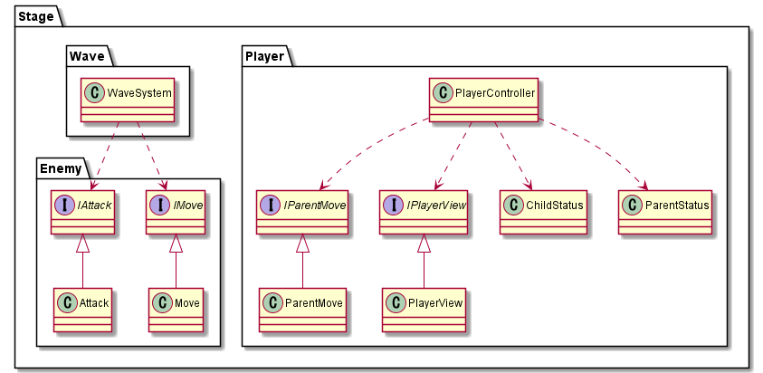

# SlimeCatch

# Requirements
* 2019.4.28f1

# Document
* [企画書](https://drive.google.com/file/d/1V93YzURLRGKeMDZ-I1FAne6o5cEKHcf1/view?usp=sharing)
* [アセット・ライブラリ一覧](https://docs.google.com/document/d/1yAwqnfoTLAJ1M1OTxQ0CAtWQDmL2anLptwJbVoJn5Ek/edit?usp=sharing)
* [作業工程表](https://docs.google.com/spreadsheets/d/1P613gn5zOtFIbPVCMY-DGtyHmPOiNgYpA50AVxFWJoE/edit?usp=sharing)
* [仕様メモ](https://docs.google.com/spreadsheets/d/1DLLXzmNkfrcQjTnwKZnKJeCioApG-z18TPqi0ZWBX28/edit?usp=sharing)
* [マスターデータ](https://docs.google.com/spreadsheets/d/1H69ZdAR6YGrBaIrlyG45CJ78pHbOWTY2GN-9hiqJn94/edit?usp=sharing)
* [BGM・SE](https://drive.google.com/drive/u/1/folders/1KWYMOdg2jH5gOC8FPS_BXAtDgPjk0hwm)

# PRの書き方(以下例)
## 関連issue
close #85

## 新機能

## 機能修正
* タイトルの名前の変更
* 名前入力画面の説明部分の名前の変更
* ローディング画面の名前の変更

## 確認事項・確認手順

- [ ] タイトル画面の名前
- [ ] 名前入力画面の名前
- [ ] ローディング画面の名前

## 備考
* ProjectSettingsを変更したため，これ以前のセーブデータが読み込めなくなりました

# Commitメッセージの書き方
Please add prefix to the beginning of the message.     
ex) feat: xxx xxx xxx

- feat: A new feature
- fix: A bug fix
- docs: Documentation only changes
- style: Changes that do not affect the meaning of the code (white-space, formatting, missing semi-colons, etc)
- add: Adding some packages or libraries
- update: update some packages or libraries

# ブランチモデル
__prefix__
- main
- feature
- fix

## main
- 直接コミットされない
- バージョンごとのタグはここから
- mainに直接pushしない
- featureブランチやfixブランチからプルリクを出してmainを更新する
- featureブランチやfixブランチはここから派生する

## feature
- 新しい機能を追加するときに切るブランチ
- developブランチから派生する

## fix
- バグを改修するときのブランチ

# 依存関係

## タイトルシーン

## ステージ選択シーン

## 各種ステージ
