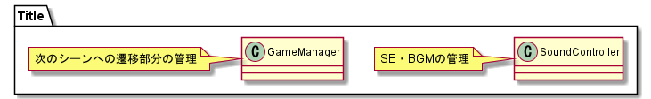
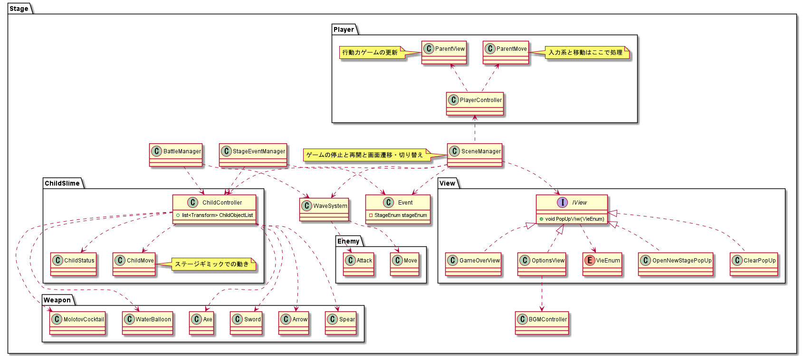

# SlimeCatch

# Requirements
* 2019.4.28f1

# Document
* [企画書](https://drive.google.com/file/d/1V93YzURLRGKeMDZ-I1FAne6o5cEKHcf1/view?usp=sharing)
* [アセット・ライブラリ](https://docs.google.com/document/d/1yAwqnfoTLAJ1M1OTxQ0CAtWQDmL2anLptwJbVoJn5Ek/edit?usp=sharing)
* [作業工程表](https://docs.google.com/spreadsheets/d/1P613gn5zOtFIbPVCMY-DGtyHmPOiNgYpA50AVxFWJoE/edit?usp=sharing)
* [仕様メモ](https://docs.google.com/spreadsheets/d/1DLLXzmNkfrcQjTnwKZnKJeCioApG-z18TPqi0ZWBX28/edit?usp=sharing)
* [マスターデータ](https://docs.google.com/spreadsheets/d/1H69ZdAR6YGrBaIrlyG45CJ78pHbOWTY2GN-9hiqJn94/edit?usp=sharing)
* [BGM・SE](https://drive.google.com/drive/u/1/folders/1KWYMOdg2jH5gOC8FPS_BXAtDgPjk0hwm)

# 依存関係

## タイトルシーン

## ステージ選択シーン

## 各種ステージ
